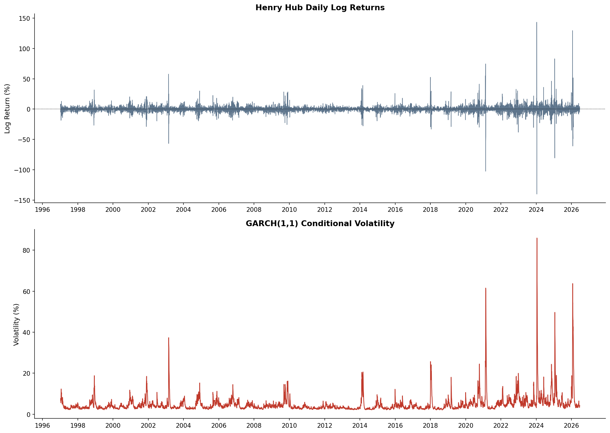
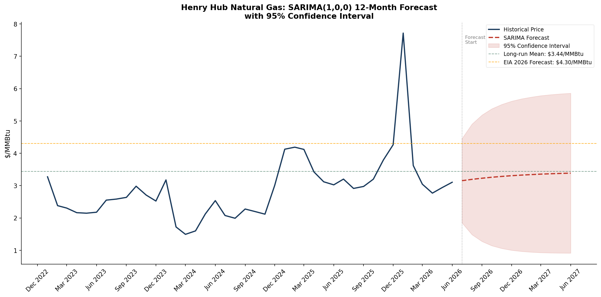

# U.S. Natural Gas Market Risk & Forecasting Analysis

Quantitative analysis of U.S. natural gas markets centered on Henry Hub spot prices, covering fundamental price drivers, risk estimation, volatility modeling, and time series forecasting.

| Component | Key Result |
|-----------|------------|
| Regression (Model 7) | Adj. R² = 0.231 |
| Student's t VaR (99%) | -62.86% monthly |
| GARCH(1,1) | α + β = 0.98 (high persistence) |
| SARIMA | 12-month forecast with 95% CI |

---

## Key Visualizations





---

## Key Findings

- Storage deficits and lagged price changes were the strongest predictors of monthly Henry Hub price movements. The one-month lagged price coefficient of -0.247 suggests partial mean reversion, consistent with supply and demand responses that push prices back toward equilibrium.
- Natural gas returns exhibited substantial fat tails. The fitted Student's t-distribution degrees of freedom of 2.17 is near the lower bound for finite variance, and the 99% VaR estimate under the t-distribution was roughly 46% larger than the normal distribution estimate (-62.86% vs. -43.10%), a material difference for position sizing and risk limit setting.
- GARCH(1,1) modeling revealed highly persistent volatility dynamics (α + β ≈ 0.98), indicating volatility shocks decay slowly following market disruptions. Conditional volatility spikes aligned with major market events including the 2002 winter squeeze, 2008–09 financial crisis, and 2021–22 European energy crisis.
- SARIMA forecasting captured both seasonal demand patterns and medium-term mean reversion in Henry Hub prices, generating a 12-month forecast with 95% confidence intervals.

---

## Overview

This project analyzes U.S. natural gas price behavior using Henry Hub spot prices. Using publicly available data from the EIA and NOAA, the analysis examines the fundamental drivers of price movement, volatility, and market risk. The project covers data acquisition, feature engineering, econometric modeling, volatility estimation, and time series forecasting.

The analysis is organized into four major components:

1. **Regression Analysis** — Identifies fundamental drivers of monthly Henry Hub price changes including storage surplus/deficit, dry gas production, total consumption, and lagged price.
2. **Value at Risk (VaR)** — Quantifies downside price risk across four methodologies, comparing distributional assumptions from normal to fat-tailed Student's t.
3. **GARCH(1,1) Volatility Modeling** — Models volatility clustering in daily returns, capturing time-varying conditional variance with a persistence sum of 0.98.
4. **SARIMA Forecasting** — Projects Henry Hub prices over a 12-month horizon using a seasonal ARIMA framework with confidence intervals.

---

## Data Sources

All data was retrieved programmatically via public APIs and government databases.

| Source | Series | Frequency | Coverage |
|--------|--------|-----------|----------|
| EIA API | Henry Hub Natural Gas Spot Price (RNGWHHD) | Daily | 1997–2026 |
| EIA API | Natural Gas Weekly Storage (Lower 48) | Weekly | 2014–2026 |
| EIA API | LNG Exports | Monthly | 2014–2026 |
| EIA API | Dry Gas Production | Monthly | 2014–2026 |
| EIA API | Total Consumption | Monthly | 2014–2026 |
| NOAA | Heating Degree Days (HDD) | Monthly | 2014–2026 |

**Feature Engineering**
- Storage surplus/deficit calculated as the difference between current storage and the rolling 5-year average
- Monthly percent change in Henry Hub price as the regression dependent variable
- Daily log returns scaled to percent for GARCH estimation
- One-month lagged price change as a predictor variable in Model 7

---

## Methodology

### Regression Analysis
Five OLS regression models were estimated to identify the fundamental drivers of monthly Henry Hub price changes. Variables were added incrementally to assess individual and combined explanatory power. The final model (Model 7) includes storage surplus/deficit, dry gas production, total consumption, and a one-month lagged price change as a mean-reversion term. Model 7 achieves an adjusted R² of 0.231, consistent with the difficulty of modeling commodity price movements, which are heavily influenced by weather shocks, market sentiment, and geopolitical events outside observable fundamentals.

### Value at Risk (VaR)
Downside price risk was estimated using four methodologies applied to monthly Henry Hub percent price changes over the 2014–2026 sample period. Historical VaR makes no distributional assumptions and is based purely on observed returns. Parametric VaR and Monte Carlo (Normal) both assume normally distributed returns and produce identical results, confirming the simulation is correctly specified. Monte Carlo (t-distribution) uses a fitted Student's t with degrees of freedom of 2.17, capturing the heavy-tailed behavior of natural gas returns. The 99% VaR estimate is approximately 46% larger under the t-distribution assumption relative to the normal, a material difference for position sizing and risk limit setting.

### GARCH(1,1) Volatility Modeling
A GARCH(1,1) model was fit to daily Henry Hub log returns over the full available history (1997–2026) using a Student's t error distribution. The estimated persistence parameter (α + β = 0.98) confirms that volatility shocks in natural gas markets are highly persistent and decay slowly over time. Conditional volatility spikes are visible around the 2002 winter squeeze, 2008–09 financial crisis, and the 2021–22 European energy crisis. GARCH-based VaR uses the most recent conditional volatility estimate rather than a fixed historical window, providing a dynamic risk measure that responds to current market conditions.

### SARIMA Forecasting
A seasonal ARIMA model was fit to the monthly Henry Hub price series. The auto_arima selection procedure identified an AR(1) specification with a seasonal period of 12 months. The model generates a 12-month price forecast with 95% confidence intervals, capturing the seasonal demand patterns and medium-term mean reversion characteristics of U.S. natural gas markets.

---

## Dashboard

An interactive Power BI dashboard (`PowerBI_Report.pbix`) is included in the repository, providing a visual summary of key market fundamentals and price dynamics. The dashboard includes time series charts for Henry Hub prices, storage surplus/deficit, dry gas production, total consumption, and LNG exports.

To use the dashboard, open `PowerBI_Report.pbix` in Power BI Desktop. The underlying data is sourced from `natgas_fundamentals.csv`.

---

## Repository Contents

- `NatGas.ipynb` — Main analysis notebook
- `PowerBI_Report.pbix` — Interactive Power BI dashboard
- `natgas_fundamentals.csv` — Cleaned monthly fundamentals dataset
- `requirements.txt` — Python dependencies
- `images/` — All output charts and visualizations

---

## How to Run

**1. Clone the repository**
```bash
git clone https://github.com/yourusername/natgas-market-analysis.git
cd natgas-market-analysis
```

**2. Install dependencies**
```bash
pip install -r requirements.txt
```

**3. Add your EIA API key**

Data is pulled directly from the EIA API. Register for a free API key at [eia.gov/opendata](https://www.eia.gov/opendata/) and replace the placeholder in the notebook:
```python
api_key = "YOUR_API_KEY_HERE"
```

**4. Run the notebook**

Open `NatGas.ipynb` in Jupyter and run all cells in order via `Kernel → Restart & Run All`.

> **Note:** NOAA HDD data was manually downloaded and preprocessed. If replicating from scratch, download monthly HDD data from [ncei.noaa.gov](https://www.ncei.noaa.gov) and format to match the existing series before running the merge cell.

---

## Tools & Libraries

- **Python** — pandas, numpy, statsmodels, pmdarima, arch, scipy, matplotlib, seaborn
- **Jupyter Notebook** — analysis and documentation
- **Power BI** — interactive dashboard
- **EIA API / NOAA** — data sources
